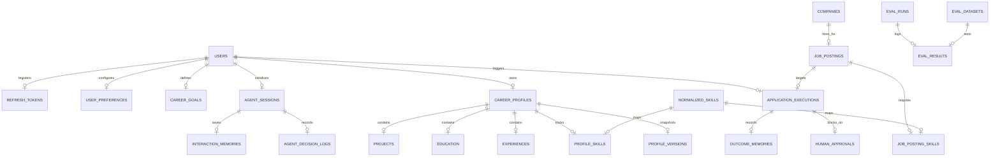

# CareerPilot Database Design Specification

This document details the PostgreSQL relational database design for CareerPilot v2. It defines all system tables, columns, constraints, index structures, foreign key relationships, and the execution order for Alembic migrations.

---

## 1. High-Level Entity-Relationship (ER) Diagram

The following Mermaid ER diagram maps out the primary entities and relationships across all bounded contexts.



---

## 2. Table Schema Definitions

### 2.1 Identity & Authentication Context

#### `users`
Represents the core user credentials account.
*   **Columns:**
    *   `id` (`UUID`, Primary Key, Default `gen_random_uuid()`): Unique user identifier.
    *   `email` (`VARCHAR(255)`, Unique, Not Null): User login email.
    *   `password_hash` (`VARCHAR(255)`, Not Null): Bcrypt password hash.
    *   `created_at` (`TIMESTAMP WITH TIME ZONE`, Not Null, Default `now()`): Creation timestamp.
    *   `updated_at` (`TIMESTAMP WITH TIME ZONE`, Not Null, Default `now()`): Last modified timestamp.
*   **Indexes:**
    *   `idx_users_email` (B-Tree, Unique): Speed up login operations.

#### `refresh_tokens`
Tracks refresh token pairs for secure session rotation.
*   **Columns:**
    *   `id` (`UUID`, Primary Key, Default `gen_random_uuid()`): Token unique ID.
    *   `user_id` (`UUID`, Foreign Key referencing `users(id)`, On Delete Cascade, Not Null): Associated user.
    *   `token_hash` (`VARCHAR(255)`, Unique, Not Null): SHA-256 hashed refresh token string.
    *   `is_revoked` (`BOOLEAN`, Not Null, Default `false`): Manual revocation flag.
    *   `expires_at` (`TIMESTAMP WITH TIME ZONE`, Not Null): Absolute token expiration.
    *   `created_at` (`TIMESTAMP WITH TIME ZONE`, Not Null, Default `now()`): Issuance timestamp.

#### `user_preferences`
User application settings and notifications.
*   **Columns:**
    *   `user_id` (`UUID`, Primary Key, Foreign Key referencing `users(id)`, On Delete Cascade): Associated user.
    *   `notification_email` (`BOOLEAN`, Not Null, Default `true`): Email digest opt-in.
    *   `auto_apply` (`BOOLEAN`, Not Null, Default `false`): Opt-in to automatic submissions.
    *   `preferred_ats_types` (`VARCHAR(50)[]`): Arrays of prioritized forms (e.g. `['greenhouse', 'lever']`).
    *   `updated_at` (`TIMESTAMP WITH TIME ZONE`, Not Null, Default `now()`).

#### `career_goals`
Tracks target configuration parameters for intelligence computations.
*   **Columns:**
    *   `id` (`UUID`, Primary Key, Default `gen_random_uuid()`).
    *   `user_id` (`UUID`, Unique, Foreign Key referencing `users(id)`, On Delete Cascade, Not Null).
    *   `target_title` (`VARCHAR(255)`, Not Null): Target position title.
    *   `target_min_salary` (`NUMERIC(12,2)`): Target salary lower bound.
    *   `preferred_locations` (`VARCHAR(100)[]`): Geo locations array.
    *   `desired_work_model` (`VARCHAR(50)`, Not Null): e.g. `remote`, `hybrid`, `onsite`.
    *   `created_at` (`TIMESTAMP WITH TIME ZONE`, Not Null, Default `now()`).
*   **Constraints:**
    *   `chk_target_min_salary`: Check `target_min_salary >= 0`.

---

### 2.2 Career Profile Context

#### `career_profiles`
Main entry point for active user profiles.
*   **Columns:**
    *   `id` (`UUID`, Primary Key, Default `gen_random_uuid()`).
    *   `user_id` (`UUID`, Unique, Foreign Key referencing `users(id)`, On Delete Cascade, Not Null).
    *   `current_version` (`INTEGER`, Not Null, Default `1`): Monotonically increasing active snapshot version.
    *   `positioning_summary` (`TEXT`): LLM generated bio.
    *   `created_at` (`TIMESTAMP WITH TIME ZONE`, Not Null, Default `now()`).
    *   `updated_at` (`TIMESTAMP WITH TIME ZONE`, Not Null, Default `now()`).

#### `profile_versions`
Snapshots history logs for version backups and rollbacks.
*   **Columns:**
    *   `id` (`UUID`, Primary Key, Default `gen_random_uuid()`).
    *   `profile_id` (`UUID`, Foreign Key referencing `career_profiles(id)`, On Delete Cascade, Not Null).
    *   `version` (`INTEGER`, Not Null): Snapshot index version.
    *   `profile_data` (`JSONB`, Not Null): Full nested snapshot backup payload.
    *   `change_reason` (`VARCHAR(255)`): Context description (e.g. "Manual UI Edit").
    *   `created_at` (`TIMESTAMP WITH TIME ZONE`, Not Null, Default `now()`).
*   **Indexes:**
    *   `idx_profile_versions_composite` (B-Tree, Unique): `(profile_id, version)`.

#### `experiences`
*   **Columns:**
    *   `id` (`UUID`, Primary Key).
    *   `profile_id` (`UUID`, Foreign Key referencing `career_profiles(id)`, On Delete Cascade, Not Null).
    *   `company_name` (`VARCHAR(255)`, Not Null).
    *   `role_title` (`VARCHAR(255)`, Not Null).
    *   `start_date` (`DATE`, Not Null).
    *   `end_date` (`DATE`): Null represents active employment.
    *   `highlights` (`TEXT[]`): Bullet list descriptions.
*   **Constraints:**
    *   `chk_experience_dates`: Check `end_date IS NULL OR end_date >= start_date`.

#### `profile_skills`
*   **Columns:**
    *   `id` (`UUID`, Primary Key).
    *   `profile_id` (`UUID`, Foreign Key referencing `career_profiles(id)`, On Delete Cascade, Not Null).
    *   `skill_id` (`UUID`, Foreign Key referencing `normalized_skills(id)`, On Delete Restrict, Not Null).
    *   `years_experience` (`NUMERIC(4,2)`, Not Null, Default `0.0`).
    *   `proficiency` (`VARCHAR(50)`, Not Null): e.g. `beginner`, `intermediate`, `expert`.
*   **Indexes:**
    *   `idx_profile_skills_composite` (B-Tree, Unique): `(profile_id, skill_id)`.

---

### 2.3 Market Intelligence Context

#### `companies`
Tracked employers profiles.
*   **Columns:**
    *   `id` (`UUID`, Primary Key, Default `gen_random_uuid()`).
    *   `name` (`VARCHAR(255)`, Unique, Not Null).
    *   `domain` (`VARCHAR(255)`): e.g. `innovateai.com`.
    *   `hiring_velocity_score` (`NUMERIC(4,2)`, Not Null, Default `0.0`).
    *   `attractiveness_score` (`NUMERIC(4,2)`, Not Null, Default `0.0`).
    *   `last_updated` (`TIMESTAMP WITH TIME ZONE`, Not Null, Default `now()`).

#### `job_postings`
Aggregated jobs parsed from ingestion sources.
*   **Columns:**
    *   `id` (`UUID`, Primary Key, Default `gen_random_uuid()`).
    *   `company_id` (`UUID`, Foreign Key referencing `companies(id)`, On Delete Cascade, Not Null).
    *   `title` (`VARCHAR(255)`, Not Null).
    *   `description` (`TEXT`, Not Null).
    *   `location` (`VARCHAR(255)`).
    *   `work_model` (`VARCHAR(50)`, Not Null): `remote`, `hybrid`, `onsite`.
    *   `salary_min` (`NUMERIC(12,2)`).
    *   `salary_max` (`NUMERIC(12,2)`).
    *   `source_url` (`VARCHAR(2048)`, Unique, Not Null).
    *   `ats_type` (`VARCHAR(50)`, Not Null): `greenhouse`, `lever`, `ashby`, `workday`, `custom`.
    *   `is_active` (`BOOLEAN`, Not Null, Default `true`).
    *   `posted_at` (`TIMESTAMP WITH TIME ZONE`).
    *   `created_at` (`TIMESTAMP WITH TIME ZONE`, Not Null, Default `now()`).
*   **Indexes:**
    *   `idx_job_postings_fts` (GIN): GIN Index on `to_tsvector('english', title || ' ' || description)` for BM25 keyword matching.

#### `normalized_skills`
Global master skill taxonomy lookup table.
*   **Columns:**
    *   `id` (`UUID`, Primary Key, Default `gen_random_uuid()`).
    *   `name` (`VARCHAR(100)`, Unique, Not Null).
    *   `aliases` (`VARCHAR(100)[]`): Alternate name structures (e.g. `['postgres', 'postgresql']`).
    *   `category` (`VARCHAR(100)`): e.g. `database`, `framework`, `language`.

#### `job_posting_skills`
Junction table connecting job postings to normalized skills.
*   **Columns:**
    *   `job_id` (`UUID`, Foreign Key referencing `job_postings(id)`, On Delete Cascade, Not Null).
    *   `skill_id` (`UUID`, Foreign Key referencing `normalized_skills(id)`, On Delete Restrict, Not Null).
*   **Constraints:**
    *   Primary Key: `(job_id, skill_id)`.

#### `skill_trends`
*   **Columns:**
    *   `id` (`UUID`, Primary Key).
    *   `skill_id` (`UUID`, Foreign Key referencing `normalized_skills(id)`, On Delete Cascade, Unique, Not Null).
    *   `frequency_pct` (`NUMERIC(5,2)`, Not Null).
    *   `growth_velocity_pct` (`NUMERIC(5,2)`, Not Null).
    *   `updated_at` (`TIMESTAMP WITH TIME ZONE`, Not Null, Default `now()`).

---

### 2.4 Execution & Outcomes Context

#### `application_executions`
Tracks pipeline statuses of active Temporal workflow runs.
*   **Columns:**
    *   `id` (`UUID`, Primary Key, Default `gen_random_uuid()`).
    *   `user_id` (`UUID`, Foreign Key referencing `users(id)`, On Delete Cascade, Not Null).
    *   `job_id` (`UUID`, Foreign Key referencing `job_postings(id)`, On Delete Cascade, Not Null).
    *   `workflow_id` (`VARCHAR(255)`, Unique, Not Null): Temporal run identifier.
    *   `status` (`VARCHAR(50)`, Not Null): `running`, `completed`, `failed`, `suspended`.
    *   `tier_attempted` (`INTEGER`, Not Null): `1` (API), `2` (Form Schema), `3` (Browser Fallback).
    *   `execution_logs` (`JSONB[]`): Audit records array.
    *   `created_at` (`TIMESTAMP WITH TIME ZONE`, Not Null, Default `now()`).
    *   `updated_at` (`TIMESTAMP WITH TIME ZONE`, Not Null, Default `now()`).

#### `human_approvals`
Pending forms holding review gate permissions.
*   **Columns:**
    *   `id` (`UUID`, Primary Key, Default `gen_random_uuid()`).
    *   `execution_id` (`UUID`, Foreign Key referencing `application_executions(id)`, On Delete Cascade, Not Null).
    *   `custom_cover_letter` (`TEXT`).
    *   `proposed_form_data` (`JSONB`, Not Null).
    *   `is_approved` (`BOOLEAN`): Null represents pending, True is approved, False is rejected.
    *   `updated_at` (`TIMESTAMP WITH TIME ZONE`, Not Null, Default `now()`).

#### `outcome_memories`
Stores outcomes used to train intelligence calibration.
*   **Columns:**
    *   `id` (`UUID`, Primary Key, Default `gen_random_uuid()`).
    *   `execution_id` (`UUID`, Unique, Foreign Key referencing `application_executions(id)`, On Delete Cascade, Not Null).
    *   `outcome` (`VARCHAR(50)`, Not Null): `applied`, `interview_callback`, `offer`, `rejection`, `ghosted`.
    *   `predicted_match_score` (`NUMERIC(5,2)`, Not Null): Predictions captured at submission.
    *   `prediction_error` (`NUMERIC(5,2)`): Computed delta after outcome confirmation.
    *   `outcome_date` (`DATE`, Not Null).
    *   `created_at` (`TIMESTAMP WITH TIME ZONE`, Not Null, Default `now()`).

---

### 2.5 Agent System Context

#### `agent_sessions`
Context logs for running LangGraph agent instances.
*   **Columns:**
    *   `id` (`UUID`, Primary Key, Default `gen_random_uuid()`).
    *   `user_id` (`UUID`, Foreign Key referencing `users(id)`, On Delete Cascade, Not Null).
    *   `thread_id` (`UUID`, Unique, Not Null): LangGraph checker session.
    *   `state_snapshot` (`JSONB`, Not Null): Serialization of Pydantic `CareerPilotState`.
    *   `created_at` (`TIMESTAMP WITH TIME ZONE`, Not Null, Default `now()`).
    *   `updated_at` (`TIMESTAMP WITH TIME ZONE`, Not Null, Default `now()`).

#### `agent_decision_logs`
Logs planning steps output by the Supervisor Agent.
*   **Columns:**
    *   `id` (`UUID`, Primary Key, Default `gen_random_uuid()`).
    *   `session_id` (`UUID`, Foreign Key referencing `agent_sessions(id)`, On Delete Cascade, Not Null).
    *   `step_index` (`INTEGER`, Not Null).
    *   `selected_agent` (`VARCHAR(100)`, Not Null): Node target router.
    *   `rationale` (`TEXT`, Not Null).
    *   `input_payload` (`JSONB`, Not Null).
    *   `output_payload` (`JSONB`, Not Null).
    *   `timestamp` (`TIMESTAMP WITH TIME ZONE`, Not Null, Default `now()`).

---

## 3. Indexing Strategy

To guarantee sub-millisecond lookups for dashboard items and high-throughput ingestion pipelines, the following indexes must be deployed:

1.  **GIN Index on Job Postings:**
    `idx_job_postings_fts` GIN index on `to_tsvector('english', title || ' ' || description)`. Essential for high-speed keyword retrieval in Stage 1 of the [Retrieval Architecture](file:///C:/Users/shiva/Desktop/Projects/CareerPilot/docs/adrs/0011-retrieval-architecture.md).
2.  **Unique Composite Index on Version Tables:**
    `idx_profile_versions_composite` unique B-Tree index on `(profile_id, version)` to ensure history integrity and speed up rollback retrievals.
3.  **Foreign Key Indexing:**
    Every foreign key column throughout `experiences`, `profile_skills`, `application_executions`, and `agent_decision_logs` must have a B-Tree index (e.g. `idx_exp_profile_id`, `idx_exec_user_id`) to prevent table-scan locks during cascade deletes.

---

## 4. Alembic Migration Ordering

Migrations are sequenced to ensure parent tables exist before child tables attempt to declare foreign key constraints.

```
Migration Sequence Flow:
[0001_auth] ➔ [0002_user_goals] ➔ [0003_career_profiles] ➔ [0004_skills_lookup] ➔ [0005_profile_details]
                                                                                      │
                                                                                      ▼
[0010_evaluations] ◄─ [0009_executions] ◄─ [0008_agent_logs] ◄─ [0007_market_telemetry] ◄─ [0006_job_listings]
```

### Sequence Step Details

*   **Step 1:** `0001_create_users_and_auth.py`
    *   Creates tables: `users`, `refresh_tokens`.
*   **Step 2:** `0002_create_user_preferences_and_goals.py`
    *   Creates tables: `user_preferences`, `career_goals`.
    *   Depends on: Step 1 (`users`).
*   **Step 3:** `0003_create_career_profiles.py`
    *   Creates tables: `career_profiles`, `profile_versions`.
    *   Depends on: Step 2 (`users`).
*   **Step 4:** `0004_create_skills_taxonomy.py`
    *   Creates tables: `normalized_skills`.
*   **Step 5:** `0005_create_profile_details_and_entities.py`
    *   Creates tables: `experiences`, `profile_skills`, `education`, `projects`.
    *   Depends on: Step 3 (`career_profiles`), Step 4 (`normalized_skills`).
*   **Step 6:** `0006_create_job_listings_and_companies.py`
    *   Creates tables: `companies`, `job_postings`, `job_posting_skills`.
    *   Depends on: Step 4 (`normalized_skills`).
*   **Step 7:** `0007_create_market_telemetry.py`
    *   Creates tables: `skill_trends`, `compensation_benchmarks`.
    *   Depends on: Step 4 (`normalized_skills`).
*   **Step 8:** `0008_create_agent_logs.py`
    *   Creates tables: `agent_sessions`, `agent_decision_logs`.
    *   Depends on: Step 1 (`users`).
*   **Step 9:** `0009_create_executions_and_outcomes.py`
    *   Creates tables: `application_executions`, `human_approvals`, `outcome_memories`.
    *   Depends on: Step 6 (`job_postings`), Step 1 (`users`).
*   **Step 10:** `0010_create_evaluations.py`
    *   Creates tables: `eval_datasets`, `eval_runs`, `eval_results`.
