# CareerPilot Dependency Graph & Implementation Strategy

This document provides a detailed mapping of CareerPilot's system architecture, epics, features, and their interdependencies. It establishes a clear execution roadmap to build the **intelligence compounding loop** before scaling execution, in line with the [Master Design Document](file:///C:/Users/shiva/Desktop/Projects/CareerPilot/docs/careerpilot_v2.md) and the [Implementation Doctrine](file:///C:/Users/shiva/Desktop/Projects/CareerPilot/docs/IMPLEMENTATION_DOCTRINE.md).

---

## 1. Mermaid Dependency Graph

Below is the visual representation of all features organized by Epic/Phase. Features highlighted in **orange** represent the **Critical Path** required to establish, execute, and calibrate the core intelligence loop.

```mermaid
graph TD
  %% Epics Grouping
  subgraph Epic1 ["Epic 1: Intelligence Foundation (Phase 1)"]
    F1_1["F1.1: Project Setup & Architecture"]
    F1_2["F1.2: Authentication & Identity"]
    F1_3["F1.3: Career Profile Domain"]
    F1_4["F1.4: Resume Import & Profile Sync"]
    F1_5["F1.5: Job Market Data Foundation"]
    F1_6["F1.6: Skill Trend Engine V1"]
    F1_7["F1.7: Career Health Score Engine V1"]
    F1_8["F1.8: Position Delta Engine"]
    F1_9["F1.9: Career Dashboard"]
  end

  subgraph Epic2 ["Epic 2: Market Intelligence Depth (Phase 2)"]
    F2_1["F2.1: Multi-Source Job Ingestion"]
    F2_2["F2.2: Advanced Deduplication"]
    F2_3["F2.3: NLP Skill Extraction"]
    F2_4["F2.4: Company Intelligence"]
    F2_5["F2.5: Ghost Posting Detection"]
    F2_6["F2.6: Compensation Intelligence"]
    F2_7["F2.7: Opportunity Intelligence"]
  end

  subgraph Epic3 ["Epic 3: Agent System (Phase 3)"]
    F3_1["F3.1: LangGraph Foundation"]
    F3_2["F3.2: Supervisor Agent"]
    F3_3["F3.3: Research Agent"]
    F3_4["F3.4: Intelligence Agent"]
    F3_5["F3.5: Interaction Memory"]
    F3_6["F3.6: Hybrid Retrieval"]
    F3_7["F3.7: Human-in-the-Loop Review"]
  end

  subgraph Epic4 ["Epic 4: Execution Engine (Phase 4)"]
    F4_1["F4.1: Temporal Infrastructure"]
    F4_2["F4.2: Application Workflow"]
    F4_3["F4.3: ATS API Integrations"]
    F4_4["F4.4: Deterministic Form Execution"]
    F4_5["F4.5: Browser Fallback Execution"]
    F4_6["F4.6: Outcome Memory System"]
  end

  subgraph Epic5 ["Epic 5: Intelligence Calibration (Phase 5)"]
    F5_1["F5.1: Evaluation Framework"]
    F5_2["F5.2: Evaluation Agent"]
    F5_3["F5.3: Outcome Calibration"]
    F5_4["F5.4: Peer Cohort Benchmarking"]
    F5_5["F5.5: ML Platform"]
  end

  subgraph Epic6 ["Epic 6: Production Hardening (Phase 6)"]
    F6_1["F6.1: Observability Platform"]
    F6_2["F6.2: Metrics & Monitoring"]
    F6_3["F6.3: Reliability Engineering"]
    F6_4["F6.4: Load & Performance Testing"]
    F6_5["F6.5: Architecture Documentation"]
  end

  subgraph Epic7 ["Epic 7: Future Scale Features (Post-MVP)"]
    F7_1["F7.1: Knowledge Graph"]
    F7_2["F7.2: Gap-Aware Retrieval"]
    F7_3["F7.3: Weekly Digest System"]
    F7_4["F7.4: Career Strategy Reviews"]
  end

  %% Epic 1 Dependencies
  F1_1 --> F1_2
  F1_1 --> F1_3
  F1_1 --> F1_5
  F1_3 --> F1_4
  F1_5 --> F1_6
  F1_2 --> F1_7
  F1_3 --> F1_7
  F1_6 --> F1_7
  F1_3 --> F1_8
  F1_5 --> F1_8
  F1_2 --> F1_9
  F1_3 --> F1_9
  F1_7 --> F1_9
  F1_8 --> F1_9

  %% Epic 2 Dependencies
  F1_5 --> F2_1
  F2_1 --> F2_2
  F1_5 --> F2_3
  F2_1 --> F2_4
  F2_1 --> F2_5
  F2_4 --> F2_5
  F2_1 --> F2_6
  F1_3 --> F2_7
  F2_4 --> F2_7
  F2_6 --> F2_7

  %% Epic 3 Dependencies
  F1_1 --> F3_1
  F3_1 --> F3_2
  F1_2 --> F3_2
  F3_1 --> F3_3
  F2_4 --> F3_3
  F3_1 --> F3_4
  F1_7 --> F3_4
  F1_8 --> F3_4
  F2_7 --> F3_4
  F3_1 --> F3_5
  F1_3 --> F3_6
  F1_5 --> F3_6
  F3_6 --> F3_3
  F3_6 --> F3_4
  F3_2 --> F3_7

  %% Epic 4 Dependencies
  F1_1 --> F4_1
  F4_1 --> F4_2
  F1_2 --> F4_2
  F3_7 --> F4_2
  F1_1 --> F4_3
  F1_1 --> F4_4
  F1_1 --> F4_5
  F4_3 --> F4_2
  F4_4 --> F4_2
  F4_5 --> F4_2
  F1_1 --> F4_6
  F1_2 --> F4_6
  F4_2 --> F4_6

  %% Epic 5 Dependencies
  F1_1 --> F5_1
  F3_1 --> F5_2
  F5_1 --> F5_2
  F4_6 --> F5_3
  F3_4 --> F5_3
  F5_1 --> F5_3
  F5_5 --> F5_3
  F1_3 --> F5_4
  F4_6 --> F5_4
  F1_1 --> F5_5

  %% Epic 6 Dependencies
  F1_1 --> F6_1
  F3_1 --> F6_1
  F4_1 --> F6_1
  F6_1 --> F6_2
  F6_2 --> F6_3
  F6_2 --> F6_4
  F5_3 --> F6_5
  F6_2 --> F6_5

  %% Epic 7 Dependencies
  F1_3 --> F7_1
  F1_5 --> F7_1
  F7_1 --> F7_2
  F3_6 --> F7_2
  F1_9 --> F7_3
  F4_1 --> F7_3
  F3_2 --> F7_4
  F3_4 --> F7_4
  F3_5 --> F7_4
  F4_1 --> F7_4

  %% Critical Path Node Highlight
  classDef critical fill:#ffaa66,stroke:#cc5500,stroke-width:2px;
  class F1_1,F1_5,F2_1,F2_4,F2_7,F3_4,F3_7,F4_2,F4_6,F5_3 critical;
```



---

## 2. Dependency Table

The following table lists all 43 features from the backlog, their bounded context, direct dependencies, and type (blocking vs. non-blocking).

| ID | Feature Name | Epic / Phase | Bounded Context | Direct Dependencies | Type | Dependency Rationale |
| :--- | :--- | :--- | :--- | :--- | :--- | :--- |
| **F1.1** | Project Setup & Architecture | Epic 1 / Phase 1 | Platform / Infra | None | - | Root platform initializer; hosts Docker, DB connection layer, and migrations. |
| **F1.2** | Authentication & Identity | Epic 1 / Phase 1 | Identity Context | F1.1 | **Blocking** | Requires database connections, FastAPI skeletal setup, and environment variables. |
| **F1.3** | Career Profile Domain | Epic 1 / Phase 1 | Career Profile | F1.1 | **Blocking** | Needs core DB schemas, migrations, repository layer, and routing base. |
| **F1.4** | Resume Import & Profile Sync | Epic 1 / Phase 1 | Career Profile | F1.3 | **Blocking** | Extraction outputs populate the database schemas defined in F1.3. |
| **F1.5** | Job Market Data Foundation | Epic 1 / Phase 1 | Market Intelligence | F1.1 | **Blocking** | Initial database schemas, ingestion worker skeletons, and API gateways. |
| **F1.6** | Skill Trend Engine V1 | Epic 1 / Phase 1 | Market Intelligence | F1.5 | **Blocking** | Daily aggregation worker runs queries against job postings ingested in F1.5. |
| **F1.7** | Career Health Score Engine V1 | Epic 1 / Phase 1 | Intelligence Synthesis | F1.2, F1.3, F1.6 | **Blocking** | Aggregates profile details, goals (from F1.2/F1.3), and market skills velocity. |
| **F1.8** | Position Delta Engine | Epic 1 / Phase 1 | Intelligence Synthesis | F1.3, F1.5 | **Blocking** | Compares structured profile skills (F1.3) vs. target job descriptions (F1.5). |
| **F1.9** | Career Dashboard | Epic 1 / Phase 1 | Intelligence Synthesis | F1.2, F1.3, F1.7, F1.8 | **Blocking** | API aggregator combining profile, goals, health score, and delta engines. |
| **F2.1** | Multi-Source Job Ingestion | Epic 2 / Phase 2 | Market Intelligence | F1.5 | **Blocking** | Scales ingestion workers; feeds directly into the postings schema in F1.5. |
| **F2.2** | Advanced Deduplication | Epic 2 / Phase 2 | Market Intelligence | F2.1 | **Blocking** | Runs similarity comparisons specifically on job data ingested from multi-sources. |
| **F2.3** | NLP Skill Extraction | Epic 2 / Phase 2 | Market Intelligence | F1.5 | **Blocking** | Operates on raw job descriptions fetched via the market foundation. |
| **F2.4** | Company Intelligence | Epic 2 / Phase 2 | Market Intelligence | F2.1 | **Blocking** | Synthesizes company profiles and calculates velocities using postings from F2.1. |
| **F2.5** | Ghost Posting Detection | Epic 2 / Phase 2 | Market Intelligence | F2.1, F2.4 | **Blocking** | Correlates posting frequency (F2.1) and company velocities (F2.4) over time. |
| **F2.6** | Compensation Intelligence | Epic 2 / Phase 2 | Market Intelligence | F2.1 | **Blocking** | Parses and normalizes salary bounds directly out of ingested job postings. |
| **F2.7** | Opportunity Intelligence | Epic 2 / Phase 2 | Intelligence Synthesis | F1.3, F2.4, F2.6 | **Blocking** | Computes fit scoring based on profile (F1.3), company (F2.4), and salary (F2.6). |
| **F3.1** | LangGraph Foundation | Epic 3 / Phase 3 | Platform / AI Infra | F1.1 | **Blocking** | Establish graph runtime, persistence state structures, and runtime tracing. |
| **F3.2** | Supervisor Agent | Epic 3 / Phase 3 | Strategy / Execution | F3.1, F1.2 | **Blocking** | Needs LangGraph core loop and user gate configs (F1.2) to orchestrate runs. |
| **F3.3** | Research Agent | Epic 3 / Phase 3 | Market / Strategy | F3.1, F2.4 | **Blocking** | Graph node executing role signals research; calls company intelligence (F2.4). |
| **F3.4** | Intelligence Agent | Epic 3 / Phase 3 | Intelligence Synthesis | F3.1, F1.7, F1.8, F2.7 | **Blocking** | Agent node integrating health scores, position delta, and opportunity scores. |
| **F3.5** | Interaction Memory | Epic 3 / Phase 3 | Platform / AI Infra | F3.1 | **Blocking** | Implements graph checkpoints, summarization, and historical persistence. |
| **F3.6** | Hybrid Retrieval | Epic 3 / Phase 3 | Platform / AI Infra | F1.3, F1.5 | **Blocking** | Configures vector/dense index containing user profile data and job postings. |
| **F3.7** | Human-in-the-Loop Review | Epic 3 / Phase 3 | Execution Context | F3.2 | **Blocking** | UI/API triggers allowing users to approve/modify briefs output by Supervisor. |
| **F4.1** | Temporal Infrastructure | Epic 4 / Phase 4 | Platform / Workflows | F1.1 | **Blocking** | Sets up worker processes, workflow configurations, and Temporal connection layer. |
| **F4.2** | Application Workflow | Epic 4 / Phase 4 | Execution Context | F4.1, F1.2, F3.7, F4.3, F4.4, F4.5 | **Blocking** | Coordinates Greenhouse/Lever integrations after human review gate approval. |
| **F4.3** | ATS API Integrations | Epic 4 / Phase 4 | Execution Context | F1.1 | Non-blocking | Integration API modules (Greenhouse, Lever) invoked by the workflow. |
| **F4.4** | Deterministic Form Execution | Epic 4 / Phase 4 | Execution Context | F1.1 | Non-blocking | Schema mappings and validation modules utilized by the workflow. |
| **F4.5** | Browser Fallback Execution | Epic 4 / Phase 4 | Execution Context | F1.1 | Non-blocking | Playwright configurations and scripts executed when APIs/schemas fail. |
| **F4.6** | Outcome Memory System | Epic 4 / Phase 4 | Execution Context | F1.1, F1.2, F4.2 | **Blocking** | Stores output results generated from executions triggered in F4.2. |
| **F5.1** | Evaluation Framework | Epic 5 / Phase 5 | Observability / QA | F1.1 | **Blocking** | Standardized evaluation dataset schemas and runner scripts for CI. |
| **F5.2** | Evaluation Agent | Epic 5 / Phase 5 | Observability / QA | F3.1, F5.1 | **Blocking** | Graph-driven agent monitoring and scoring outputs from other agents. |
| **F5.3** | Outcome Calibration | Epic 5 / Phase 5 | Intelligence Synthesis | F4.6, F3.4, F5.1, F5.5 | **Blocking** | Correlates and updates scoring models (F3.4) based on real outcomes (F4.6). |
| **F5.4** | Peer Cohort Benchmarking | Epic 5 / Phase 5 | Intelligence Synthesis | F1.3, F4.6 | **Blocking** | Groups and ranks user profiles (F1.3) utilizing historical outcomes (F4.6). |
| **F5.5** | ML Platform | Epic 5 / Phase 5 | Platform / ML Infra | F1.1 | **Blocking** | Self-hosted MLflow deployment to track calibration metrics and version models. |
| **F6.1** | Observability Platform | Epic 6 / Phase 6 | Platform / Observability | F1.1, F3.1, F4.1 | **Blocking** | OpenTelemetry tracer hooks for FastAPI routers, LangGraph, and Temporal workflows. |
| **F6.2** | Metrics & Monitoring | Epic 6 / Phase 6 | Platform / Observability | F6.1 | **Blocking** | Configures Prometheus & Grafana scrapes and dashboards based on OTEL metrics. |
| **F6.3** | Reliability Engineering | Epic 6 / Phase 6 | Platform / Observability | F6.2 | **Blocking** | Adds circuit breakers, rate limits, and SLO monitoring checks. |
| **F6.4** | Load & Performance Testing | Epic 6 / Phase 6 | Platform / Observability | F6.2 | Non-blocking | Locust performance test scripts run against local environments. |
| **F6.5** | Architecture Documentation | Epic 6 / Phase 6 | Platform / Documentation | F5.3, F6.2 | Non-blocking | Final comprehensive documentation of the fully deployed system. |
| **F7.1** | Knowledge Graph | Epic 7 / Post-MVP | Platform / Knowledge | F1.3, F1.5 | **Blocking** | Installs Neo4j database and loads nodes/edges representing skills, roles, and profiles. |
| **F7.2** | Gap-Aware Retrieval | Epic 7 / Post-MVP | Platform / AI Infra | F7.1, F3.6 | **Blocking** | Graph traversal extensions mapped to hybrid retrieval algorithms. |
| **F7.3** | Weekly Digest System | Epic 7 / Post-MVP | Strategy / Comm | F1.9, F4.1 | Non-blocking | Weekly summary digest generated and sent via a Temporal cron workflow. |
| **F7.4** | Career Strategy Reviews | Epic 7 / Post-MVP | Strategy Context | F3.2, F3.4, F3.5, F4.1 | Non-blocking | LangGraph-orchestrated monthly reviews executed via Temporal scheduler. |

---

## 3. Critical Path Analysis

The **Critical Path** for CareerPilot focuses on delivering the core **Intelligence Compounding Loop**—the key competitive moat of the product. The path ensures that the system can ingest market data, score opportunities, generate agent-driven decisions, execute applications, capture real outcomes, and calibrate models accordingly. 

Delaying any feature in this path directly pushes back the validation of CareerPilot's product thesis: *calibrating predictions against actual outcomes.*

```
[F1.1: Project Setup & Architecture] 
  └── [F1.5: Job Market Data Foundation] 
        └── [F2.1: Multi-Source Job Ingestion] 
              └── [F2.4: Company Intelligence] 
                    └── [F2.7: Opportunity Intelligence] 
                          └── [F3.4: Intelligence Agent] 
                                └── [F3.7: Human-in-the-Loop Review] 
                                      └── [F4.2: Application Workflow] 
                                            └── [F4.6: Outcome Memory System] 
                                                  └── [F5.3: Outcome Calibration] (Model Validation Moat)
```

### Critical Path Trace & Rationale

1. **F1.1 (Setup) ➔ F1.5 (Job Foundation):** You cannot create schemas or register background ingestion tasks for job postings without base database layers and configuration setups.
2. **F1.5 (Job Foundation) ➔ F2.1 (Multi-Source Ingestion):** Scaled integration with external job endpoints (Adzuna, JSearch) requires the base ingestion structure and schema.
3. **F2.1 (Multi-Source Ingestion) ➔ F2.4 (Company Intelligence):** Hiring velocity metrics and company directories are derived directly from the aggregate volume of crawled jobs.
4. **F2.4 (Company Intelligence) ➔ F2.7 (Opportunity Intelligence):** Real opportunity scoring requires factoring in company attractiveness alongside profile similarity.
5. **F2.7 (Opportunity Intelligence) ➔ F3.4 (Intelligence Agent):** The agent cannot synthesize comprehensive explanations or evaluate positioning without the underlying Opportunity scoring engines.
6. **F3.4 (Intelligence Agent) ➔ F3.7 (Human Gate):** High-impact agent outputs require structured human approval gates before committing to execution.
7. **F3.7 (Human Gate) ➔ F4.2 (Application Workflow):** The Temporal workflow cannot execute form fillings or submissions without user-approved briefs and configurations.
8. **F4.2 (Application Workflow) ➔ F4.6 (Outcome Memory System):** Collecting application outcome data (interviews, rejections) relies on the workflow recording the initial submission audit trace.
9. **F4.6 (Outcome Memory System) ➔ F5.3 (Outcome Calibration):** The ML calibration module (which correlates predicted scores to actual results) cannot be trained or validated without a history of recorded outcomes.

---

## 4. Recommended Implementation Order

This sequencing orders all 43 features linearly. It respects technical dependencies (e.g., schemas before APIs) and architectural sequencing (e.g., verifying the intelligence loop before scaling browser automations).

### Epic 1: Intelligence Foundation (Weeks 1–4)
1. **F1.1: Project Setup & Architecture** — Establish repositories, environments, database setups, and base migrations.
2. **F1.2: Authentication & Identity Context** — Secure the platform and enable user profile ownership and preference schema.
3. **F1.3: Career Profile Domain** — Implement the basic schema for skills, education, experiences, and profiles.
4. **F1.4: Resume Import & Profile Sync** — Build the parsing and extraction pipeline to populate user profiles.
5. **F1.5: Job Market Data Foundation** — Setup ingestion workers and normalized schemas for jobs.
6. **F1.6: Skill Trend Engine V1** — Run basic aggregation metrics on postings data to establish skill velocities.
7. **F1.8: Position Delta Engine** — Create heuristic gap calculations comparing profile skills to target jobs.
8. **F1.7: Career Health Score Engine V1** — Build the heuristic-based scoring model (incorporating skills, comp, goals).
9. **F1.9: Career Dashboard** — Assemble widgets into a unified homepage API aggregator and client view.

### Epic 2: Market Intelligence Depth (Weeks 5–8)
10. **F2.1: Multi-Source Job Ingestion** — Enable Adzuna, JSearch, and startup crawler integrations.
11. **F2.2: Advanced Deduplication** — Deploy similarity clustering to deduplicate postings.
12. **F2.3: NLP Skill Extraction** — Hook up spaCy NLP extraction to identify skill names and aliases.
13. **F2.4: Company Intelligence** — Aggregate company profiles and calculate hiring trends.
14. **F2.5: Ghost Posting Detection** — Analyze job posting ages to flag non-hiring notices.
15. **F2.6: Compensation Intelligence** — Parse salary bounds and build basic percentiles.
16. **F2.7: Opportunity Intelligence** — Release the personalized opportunity matching and ranking engine.

### Epic 3: Agent System (Weeks 9–13)
17. **F3.1: LangGraph Foundation** — Deploy the agent state machine execution framework and persistence.
18. **F3.5: Interaction Memory** — Deploy context logging, checks, and checkpoint storage.
19. **F3.6: Hybrid Retrieval** — Implement Qdrant + BM25 keyword matching for job context retrieval.
20. **F3.2: Supervisor Agent** — Build the primary orchestrator mapping prompts to routing states.
21. **F3.3: Research Agent** — Assemble the research flow summarizing role and company details.
22. **F3.4: Intelligence Agent** — Deploy the synthesis flow evaluating health metrics and delta explanations.
23. **F3.7: Human-in-the-Loop Review** — Establish frontend review tools and endpoints.

### Epic 4: Execution Engine (Weeks 14–18)
24. **F4.1: Temporal Infrastructure** — Spin up the Temporal workflow orchestrator and queue workers.
25. **F4.3: ATS API Integrations** — Build Greenhouse, Lever, and Ashby API client modules.
26. **F4.4: Deterministic Form Execution** — Map form schemas for Workday, iCIMS, etc.
27. **F4.5: Browser Fallback Execution** — Create Playwright fallback scripts for non-standard sites.
28. **F4.2: Application Workflow** — Wire the application state machine handling retries and gates.
29. **F4.6: Outcome Memory System** — Deploy tables and triggers recording downstream application successes/fails.

### Epic 5: Intelligence Calibration (Weeks 19–22)
30. **F5.1: Evaluation Framework** — Establish test suite evaluation datasets and metrics.
31. **F5.2: Evaluation Agent** — Build the quality validator agent checking other agents' work.
32. **F5.5: ML Platform** — Deploy MLflow to track calibration metrics.
33. **F5.3: Outcome Calibration** — Deploy the calibration algorithm correlating predictions to actual outcomes.
34. **F5.4: Peer Cohort Benchmarking** — Group users by background similarity and generate cohorts.

### Epic 6: Production Hardening (Weeks 23–26)
35. **F6.1: Observability Platform** — Setup OpenTelemetry hooks.
36. **F6.2: Metrics & Monitoring** — Setup Prometheus metrics scraping and Grafana dashboard alerts.
37. **F6.3: Reliability Engineering** — Deploy circuit breakers, rate limit middleware, and SLO budgets.
38. **F6.4: Load & Performance Testing** — Execute Locust scripts to verify latency tolerances.
39. **F6.5: Architecture Documentation** — Write ADRs, operations manuals, and onboarding guides.

### Epic 7: Future Scale Features (Post-MVP)
40. **F7.1: Knowledge Graph** — Deploy Neo4j and ingest skills, company, and role node relationships.
41. **F7.2: Gap-Aware Retrieval** — Integrate Neo4j traversals into the hybrid search logic.
42. **F7.3: Weekly Digest System** — Deploy weekly Temporal workflows email alerts.
43. **F7.4: Career Strategy Reviews** — Enable monthly agent strategy sessions and goal evaluations.
